# Applied Mathematical Analysis on UFC Boxing dataset

## Abstract

### 1. Introduction

### 2. Methods

#### $\quad$ 2.1. Data Collection

#### $\quad$ 2.2. Data Preprocessing and Analysis

#### $\quad$ 2.3 Clustering

##### $\quad$ $\quad$ 2.3.1 Agglomerative Hierarchical Clustering

##### $\quad$ $\quad$ 2.3.2 K Means Clustering

#### $\quad$ 2.4 KNN

#### $\quad$ 2.5 logistic regression

#### $\quad$ 2.6 Decision trees

#### $\quad$ 2.7 Random Forest

#### $\quad$ 2.8 XGBoost

#### $\quad$ 2.9 Artificial Neural Networks (aNN)

### 3. Conclusion

### 4. Appendices

\newpage

## 2.2. Data Preprocessing and Analysis

### Preliminary cleaning

Firstly, since all winners are recorded as red side before March 2010, which makes the data imbalance, we drop all the observations before that time. Then we use na.omit() to drop all the observations in the dataset with NA values and remove some irrelevant variables based on the domain knowledge, including fighters' names, referee's name, date, etc.

### Check the percentage of categorical variables

Since there are several categorical variables in the dataset, we use pie plots to check the percentage of each class in those variables. For our response variable "Winner", we can see that class "Red" and class "Blue" occupies about 57% and 41% respectively, while class "Draw" only occupies less than 2%.Therefore, we remove class "Draw" to make the response variable more balanced, and also to make our task a binary classification, which is a simpler task than multiclass classification. For variable "weight class", we can see from the pieplot that all women weight classes occupy less than 3%, and catchweight only occupies 0.5%. Therefore, we decide to drop all these variables to make this categorical variable more balanced.

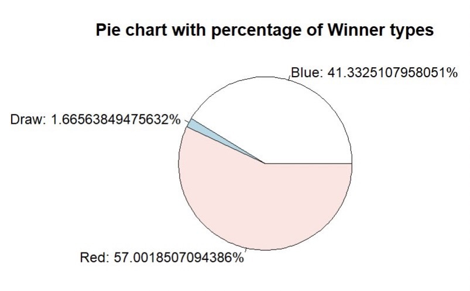{width="325"}

### Merge columns

We can merge some related columns to reduce the dimension of the dataset. We merge "current win streak" and "current lose streak" into one column "current streak", and positive numbers in this new variable stands for winning streak and negative number stands for losing streak. Also, since win by majority decision and win by split decision rarely happen, basically we can merge three kinds of decision win into one column "win by decision".

### Check the correlations between variables

Since the number of the remaining variables is still large, we start from checking the correlation of specific variables based on background knowledge to reduce the number of variables. It's common sense that the more strikes you throw, the more strikes are likely to land on your opponent. Therefore, we first use scatter-plots and correlations to check the relationship between every "strikes landed" variable and its corresponding "strikes attempt" variable. As we can see in the plots and from the correlations, all "strikes landed" variables and its corresponding "strikes attempt" variables are highly linearly dependent and the correlations are all above 80%, so we decide to drop all "strikes attempt" variables. Also, the correlation between "significant strikes landed" and "total strikes landed" is high (0.85), so we remove "total strikes landed". It's also common sense that the taller one person is, the longer his arms are likely to be. Thus we check the relationship between variable "height" and variable "reach". As we can see, the correlation is 87% and the scatter plot also suggests a highly linear dependence, so we drop the "height" column.

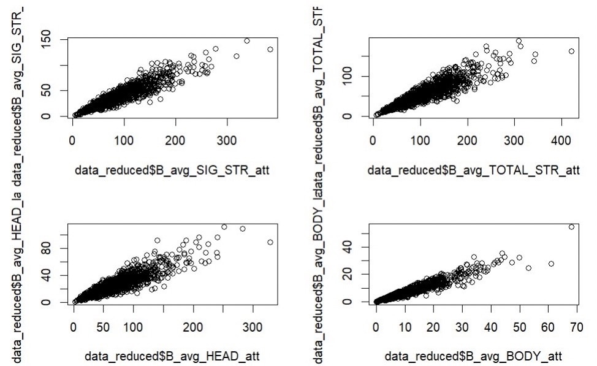{width="325"}

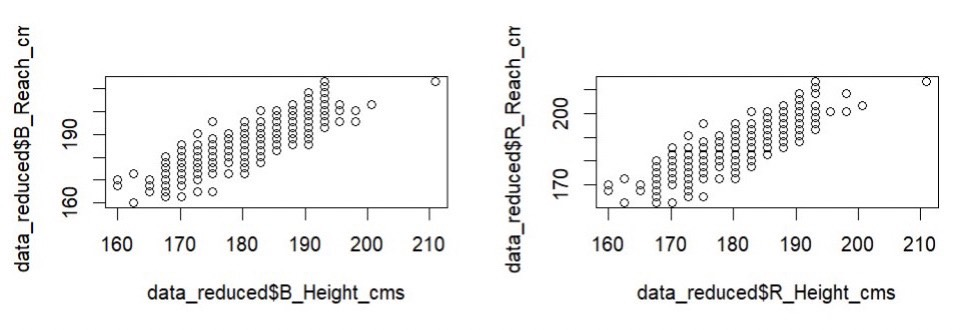{width="325"}

Next we take a look at the correlation matrix of the remaining variables to see if there's any interesting relationship between them. We use a loop to iterate through the matrix and print all the correlations which are larger than 0.4. Below are our findings.

1.  "average clinch strikes landed" is only correlated with "average body strikes landed", which means a fighter mostly attacks the opponent's body in the clinch position.

2.  The four variables, "average takedown percentage", "average takedown landed", "average control time", "average ground strikes landed", are correlated with one another to some extent (range from 0.42 to 0.75). The interpretation is that after a fighter takes his opponent down, he basically just controls his opponent on the ground and punches him on the ground.

3.  "Average knockdown" is correlated with "win by KO/TKO percentage". The interpretation is that if one can knock his opponent down easily, he's more likely to knock his opponent out and end the fight.

4.  "Average submission attempt" is correlated with "win by submission percentage", which is quite intuitive because the more submissions one attempts, the more likely he can submit his opponent and end the fight.

5.  "Average total time fought" is correlated with "win by decision percentage". The result of a fight is decided by judges when both fighters cannot finish each other before the time runs out. Therefore, the more time one spends in a fight, the more likely he fights for a full 15 minutes and then wins by decision.

### Use boxplots to check the effect of variables on winners and losers

We transform that data and create some columns for losers' stats and some others for winners' stats. Then we use boxplots to see the difference of the distribution X variables between winners and losers. Based on the boxplots, we can see that the distribution of some variables in 'winners' and 'losers' actually don't have a clear difference. Therefore, we decide to remove "avg KD", "avg SIG STR pct", "avg TD pct", "avg REV", "avg CLINCH landed", "total time fought.seconds.", "total rounds fought", "win by KO.TKO", "win by Submission", "win by Decision", "current streak", "total title bouts", "wins", "losses".

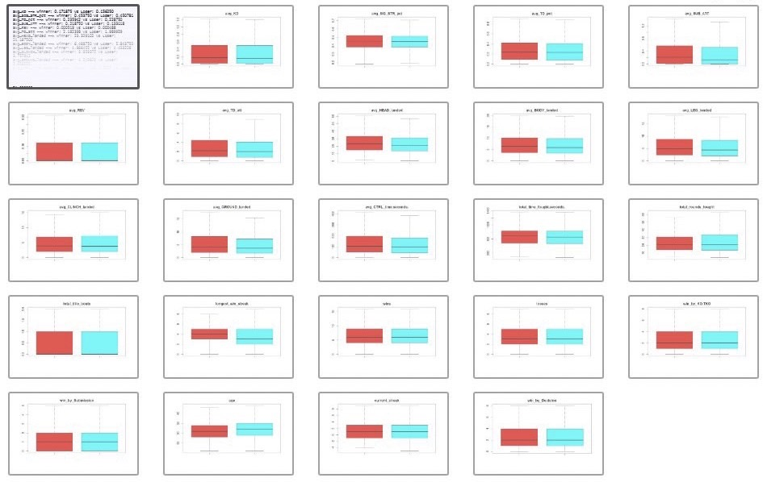{width="300"}

### Further explore the relationship between variables in each weight class

Now we further explore the relationship between variables to see if we can get some interesting findings. First we divide the data into groups based on the weight classes. Then we draw the side-by-side boxplots to see the distribution of each variable in different weight classes. From the side-by-side boxplots above, we can find some interesting facts.

1.  The stereotype that Heavyweight fighters barely grapple (wrestling, jiu-jitsu, etc) is real. We can see that Heavyweight has the lowest median in almost every stat related to grappling, including "average takedown percentage", "average submission attempt", "average reverse", "average takedown landed", "average clinch strikes landed", "average control time" and "win by submission percentage".

2.  The power of fighters must have something to do with their weight. The concept that Heavyweight fighters have the most power in their hands is true. We can see that Heavyweight has the highest "average knockdown" among all divisions. Also, Heavyweight has the highest "win by KO/TKO percentage" among all divisions (also has the lowest "win by Decision percentage"), actually it's way higher than other weight classes, which mean Heavyweight fighters frequently end the fight by knocking out their opponents. In contrast, Flyweight has the lowest "average knockdown" and the lowest "win by KO/TKO percentage" (highest "win by decision percentage" also), which means Flyweight fighters don't have enough power to hurt their opponent so that their fights tend to end in judge decisions. Additionally, we can actually see in the boxplots that higher weight classes have higher "win by KO/TKO percentage" and lower "win by decision percentage", which further suggests the relationship between one's weight and power.

3.  The higher the weight class is, the taller the fighters are and the longer their reaches are. (This is actually a common sense)

There's also a few counterintuitive findings.

1.  This first one is that while most people think that Heavyweight fighters are less skillful, they actually have the highest "average significant strike percentage", which means they land their strikes more accurately than fighters in other weight classes.

2.  Another finding is that the ages of Heavyweight fighters are actually the oldest among all weight classes. Many people think Heavyweight fighters usually have relatively shorter careers than fighters in other divisions because they are facing more powerful opponents, but surprisingly the boxplot says otherwise.

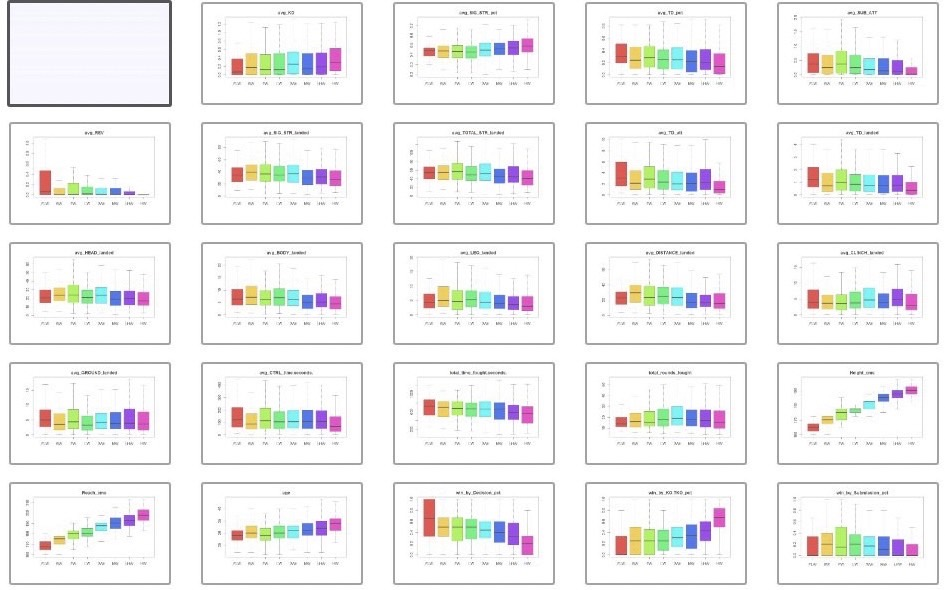{width="300"}

Next we use side-by-side boxplots to see the distribution of each variable in different genders.

1.  Male fighters generally are more powerful than female fighters.

From the boxplots we can see that male fighters have higher "average knockdown" in both Flyweight and Bantamweight. Also, female fighters have higher "win by decision percentage" than male fighters in both weight classes, which means they generally lack the power to finish their opponents. That is probably why female fighters also have longer "average total time fought".

2.  Female fighters tend to throw more strikes than male fighters.

From the boxplots we can see that female fighters have more "average strikes landed" in almost every department, including significant strikes, head strikes, body strikes, leg strikes, etc.

3.  Female fighters are generally older than male fighters.

We can see that the median of "age" of female fighters are larger than male fighters in both weight classes.

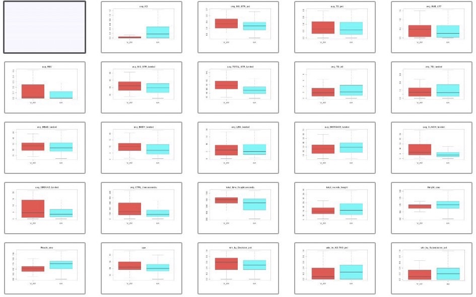{width="300"}

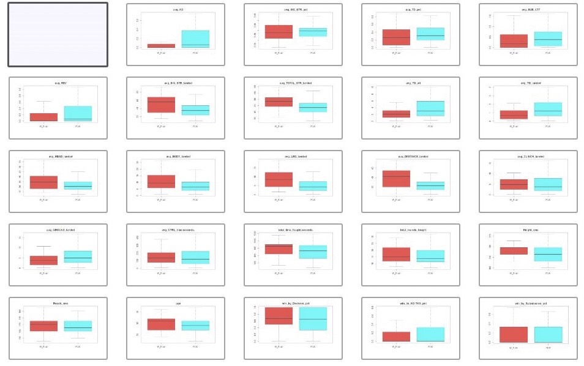{width="300"}

## 2.3 Clustering

### 2.3.1 Agglomerative Hierarchical Clustering

First we want to focus on the concentration of distribution of the data points in the entire system, we want to quantitatively estimate the relation between every sample in the system and study how close each data point is related to each other in the system. To achieve this objective, we choose to start with hierarchical clustering to see how many possible clusters there are which are able to explain the data distribution.

The Agglomerative Hierarchical Clustering takes a bottom-up approach where it assumes individual data observation to be one cluster at the start. Then it starts merging the data points into clusters till it creates one final cluster at the end with all data points, which could be presented as the dendrogram below.

By applying the 'hclust' function on three different linkage methods, we are able to determine that there are 5 different data distribution pattern, and we are able to identify some of data distribution characteristic, which are:

1.  There are no distinguishable differences between the winrate in different cluster.

2.  There are distinguishable differences between the pre-fight stats of fighter in different weight class.

3.  There are distinguishable differences between the pre-fight stats of fighters in different clusters.

Which indicates that:

1.  There are only limited correlations between some of the pre-fight stats and the Win rate.

2.  The fighter in different weight class follows different distributions pattern.

3.  It is not reasonable to use the cluster we have here to predict a fighter's win rate.

### 2.3.2 K means clustering

#### Data Cleaning

By using `table()` to check the target weight classes, we found that there exists women weight classes, and catch-weight class, which does not imply with the sampling rule, numbers of data should be at least 30. Hence, we remove the women weight classes and catch-weight class due to the reason that we focus on men weight classes, whose numbers in each class are at least 30. We got eight classes Featherweight, Flyweight, Heavyweight, LightHeavyweight, Lightweight, Middleweight, Welterweight eventually.

There are several steps to process K means:

1.  Split data into eight class Through `fviz_nbclust()` to find the optimal number of clusters

2.  Build model with `kmeans()`

3.  Cluster data with `fviz_cluster()`

4.  Utilizing `ggparcoord()` to explore the relation of variables in different clusters.

From the plots below, it is clear that the best optimal number of clusters is two in all eight classes. Hence, we set all the parameters of cluster number in `kmeans()` as two.

{width="420"}

{width="420"}

Based on the plots below, we find that actually fighters in each weight class can all be separated into two clusters with exactly the same pattern

To be more understable, based on the plot below, we could generalize that if the fighters get more points at "average control time" and "average ground strikes landed" then we classify it as cluster 1, and if fighters win by submission often then we classify them as cluster 2.

{width="420"}\
\
Take a close look at the difference of two clusters, it is obvious that fighters in cluster 1 getting more points in "average ground strikes landed", "average control time", "average significant strikes landed", "avg head/distance strikes landed", so we could conclude that fighters in cluster 1 tend to be wrestlers ("average ground strikes landed", "average control time") or volume strikers ("average significant strikes landed", "avg head/body/distance strikes landed").

Fighters in cluster 2 specialize in "average knockdown", "average takedown attempt", "average submission attempt", "average body/clinch strikes landed". Hence we deduce that fighters in cluster 2 should be either submission artists ("average submission attempt", "average takedown attempt", "average body/clinch strikes landed") or heavy hitters("average knockdown").

As for the win method, fighters in cluster 1 tend to win the fights by decision, while fighters in cluster 2 tend to win the fights by finishing their opponents, either with submission or knockout.

### conclusion in K Means

To sum up, all the fighters in eight weight classes can be separated into two groups, boring decision fighters or exciting finishers. Finishers are fighters who either have more submission attempts or more knockdowns. Boring decision fighters are fighters who prefer to control their opponents on the ground and throw some ground strikes, or fighters who love standing up and throw a lot of punches but never finish their opponents.

### 2.3.3 Principal component analysis(PCA)

Principal component analysis, or PCA, is a dimensionality_reduction method that is often used to reduce the dimensionality of large data sets, by transforming a large set of variables into a smaller one that still contains most of the information in the large set.In this part we are focusing on finding the first two principal components of the 'ufc_data' , and try to explain which variable has the greatest impact on the data's variability.

The main step for the Principal component analysis are:

1.  Standardization

2.  Covariance Matrix Computation

3.  Compute the eigenvectors and eigenvalues of the covariance matrix to identify the principal components.

$w_{(1)} =\arg\max_{\Vert w \Vert = 1} \,\left\{\sum_i(t_1)^2_{(i)}\right\}= \arg\max_{\Vert w \Vert = 1} \,\left\{ \sum_i \left(x_{(i)} \cdot w \right)^2 \right\}$

The k-th component can be found by subtracting the first k-1 principal components from X:

$\hat{\textbf{X}_{k}} = \textbf{X}-\sum_{s=1}^{k-1}\textbf{X}\textbf{w}_{\left( s \right)}\textbf{w}^{^{\textbf{T}}}_{\left( s \right)}$

From the Principal component analysis(PCA) we are able to obtain the principal components of the 'ufc_data' which is listed below:

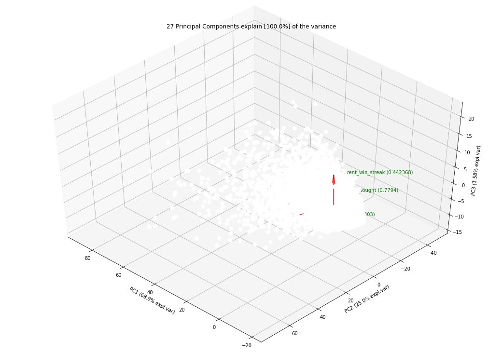{width="300"}

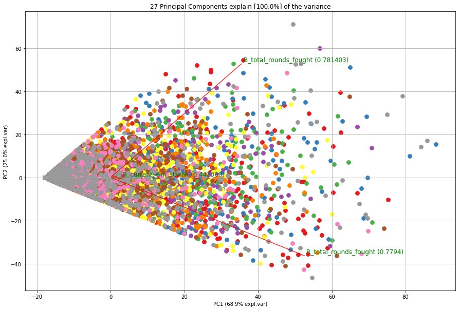{width="300"}

Based on the plot above we can see that the first two components explained about 26.86% of the variance from the dataset, while on the PC1/PC2 plane, we can clearly see that the variables are able to fit in three different classes which are:

1.  B side variables- Such as 'B_average_opp_distance_landed' ,which has negative impact on the PC1 but positive impact on the PC2

2.  R side variables- Such as 'B_average_opp_distance_landed' which has negative impact on both PC1 and PC2, and independent from the B side variables

3.  Neutral variables-Such as 'B_avg_CTRL_time(seconds)' which mostly only impact on the PC1 but not PC2

Based on the PCA evidence we are able to reduce the number of variables by picking up different variables from each category, and by determining the length of each variable on the PC1/PC2 plane, we are able to find the most significant variable among them.

## 2.4 logistic regression

1.  Split the dataset into training set and testing set

We use `createDataPartition()` to split the dataset into the training and the testing set(80:20).

2.  Fit the logistic regression model

Use glm() to fit a logistic regression model with all X variables. (pic) And then we predict the Winner with this model on the training set and the testing set respectively. For the training set, we have an accuracy of 61.6%; for the testing set, we have an accuracy of 55.5%.

3.  Use forward stepwise selection to select the variable combinations with smallest AIC

Then we use stepAIC() to find the optimal variable combination for fitting. Below is the final model we get.(pic) And then we predict the Winner with this model on the training set and the testing set respectively. For the training set, we have an accuracy of 61.7%; for the testing set, we have an accuracy of 56.2%.

## 2.6 Decision trees

There are several steps to process Decision trees

1.  Split data into training data and testing data (proportion set as 4:1 )

2.  Build a decision trees model with training data.

3.  Predict testing data with model

4.  Adjust parameter with `rpart.control()` to find the better model

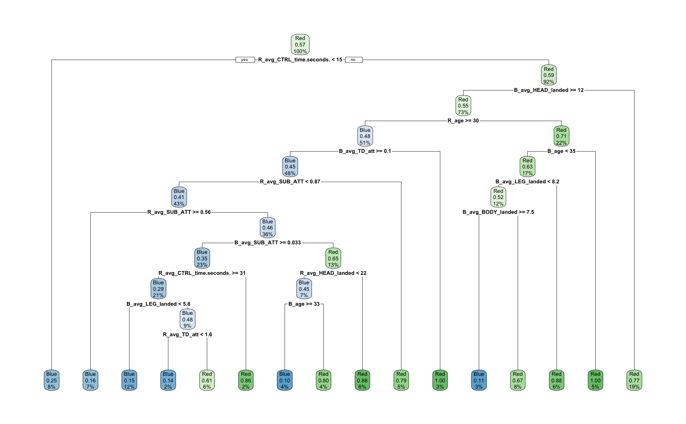{width="300"}\
\
Through decision trees to predict the winner, we found that the model started to determine the winner by average control time of the players noted as red, namely 'R_avg_CTRL_time.seconds'.

\
However, the model did not have a great accuracy rate, namely 55.3%, on testing data prediction. Hence, we will adjust the parameter in `rpart.control()`. After the modification, it is surprising that the accuracy increased from 55.3% to 63.2%.

## 2.7 Random forest

There are several steps to process

1.  Split data into training data and testing data (proportion set as 4:1 )

2.  Build a random forest model with training data.

    1.  Predict testing data with model

        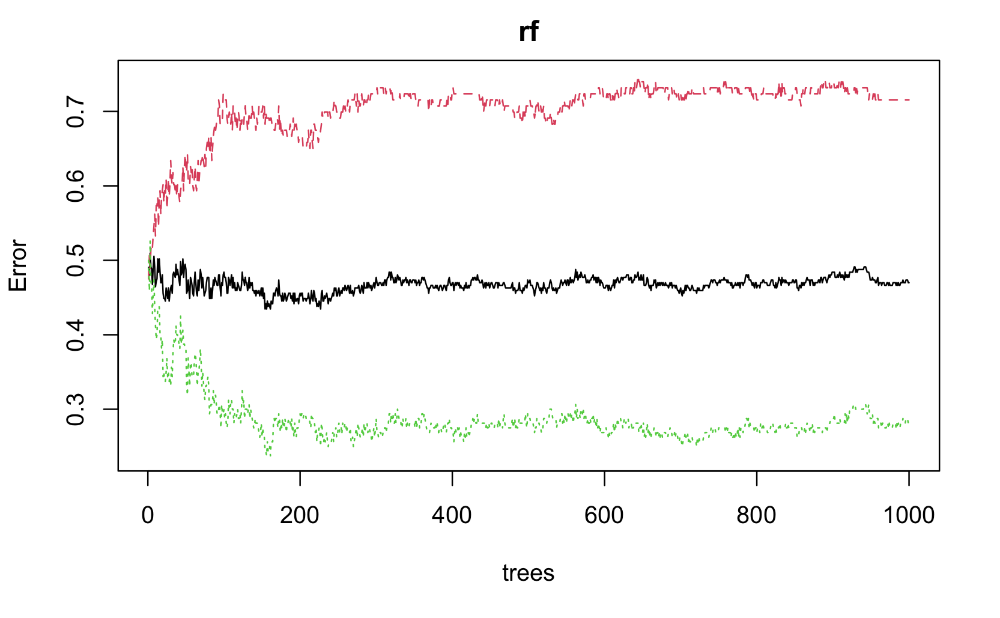{width="300"}

However, the Out of Bag (OOB), namely black line, shows that there is no significant change in error rate with the increasing tree.The result shows that the accuracy of predicting testing data is 56.8%

## 2.8 XGBoost

1.  Split the dataset into training set and testing set.

We use `createDataPartition()` to split the dataset into the training and the testing set (80:20).

2.  Train a preliminary model (pic)

We first set the max depth to 4 and training rounds to 100, and then train a preliminary model.

3.  Train a finalized model

We can see that we have the minimum testing rmse in the 16th round, and after that the model starts to be overfitted. Therefore we set the training rounds to 16 and then train a finalized model, and then we predict the Winner with this model on the training set and the testing set respectively. For the training set, we have an accuracy of 85.6%; for the testing set, we have an accuracy of 58.9%.

## 2.9 Artificial Neural Networks (aNN)

We build a 3-layer ANN model with 'relu', 'tanh' and 'sigmoid' activation functions with 9964 neurons in each layer. After training for 1000 epochs. We are able to use K-fold Validation to check the model lost and accuracy:

Loss:Categorical Cross-entropy

Accuracy: Train set Observational error

Validation Loss:Validation set Categorical Cross-entropy

Validation Accuracy:Validation set Observational error

### Determination of overfitting and underfitting

From the plot above we observe that the 'Validation Accuracy' reaches its maximum at 0.62 when epochs approach 150 and the 'Validation Loss' also start to increase dramatically as epochs exceed 200. It could be explained to be the overfitting of the model and we are able to set the optimal epoch to be around 150 with the model accuracy of 62%.

## 3. Conclusion

Overall, the prediction accuracy of most model are between 55% to 60%. Moreover, aNN model and decision tree model have the better accuracy, 62% and 63.2% separately.

The reason why our models could not have higher accuracy (\>70%) is probably that our selection of variables isn't good enough, or there might be too many factors affecting the outcome of a fight.
